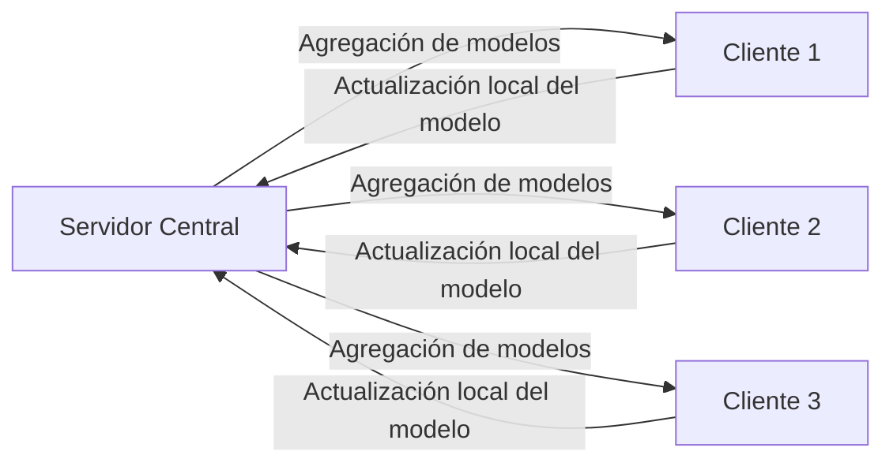
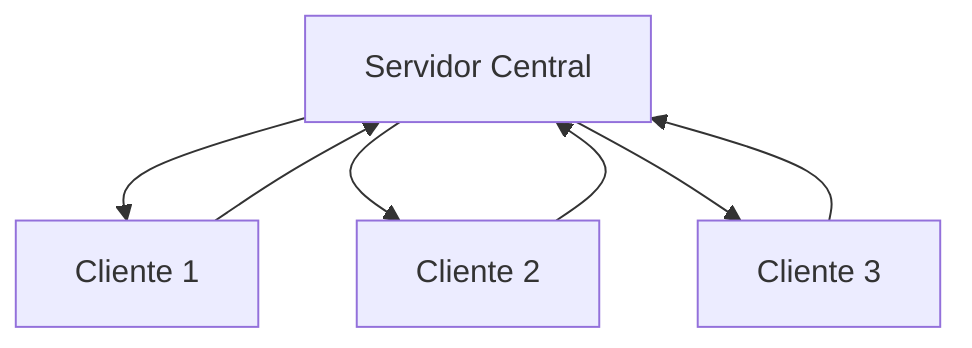
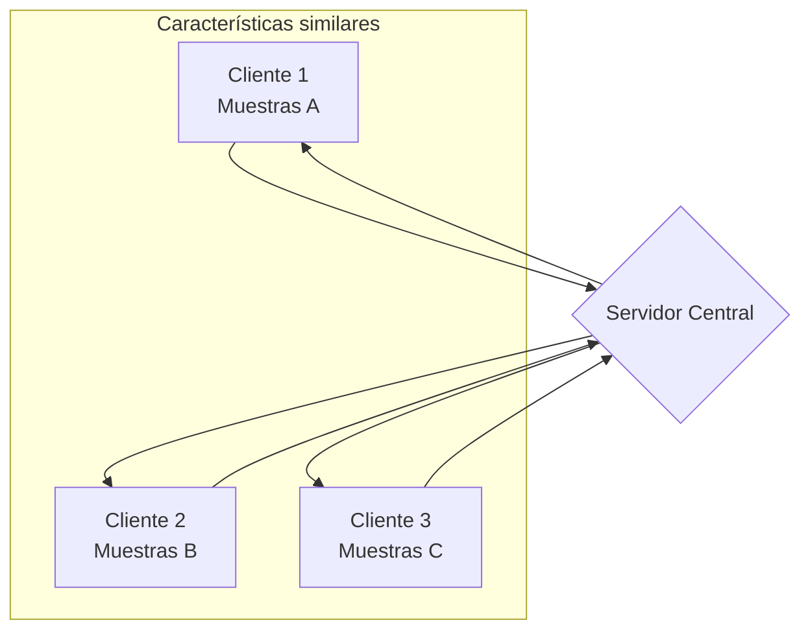
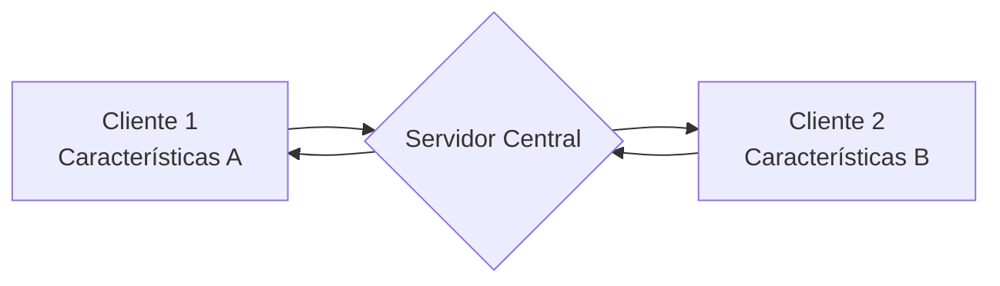

# Curso: Introducción al Aprendizaje Federado (Federated Learning)

## Descripción del curso
Este curso está diseñado para principiantes que desean aprender sobre el Aprendizaje Federado (Federated Learning), una técnica de aprendizaje automático distribuido que permite entrenar modelos sin centralizar los datos. A lo largo del curso, los estudiantes aprenderán los conceptos fundamentales, la arquitectura y las aplicaciones del Aprendizaje Federado.

## Objetivos del curso
Al finalizar este curso, los estudiantes serán capaces de:

- Comprender los principios básicos del Aprendizaje Federado.
- Identificar los desafíos y beneficios del Aprendizaje Federado en comparación con los enfoques tradicionales de aprendizaje automático.
- Familiarizarse con la arquitectura y los componentes clave del Aprendizaje Federado.
- Conocer las aplicaciones y casos de uso del Aprendizaje Federado en diferentes industrias.

## Requisitos previos
- Conocimientos básicos de aprendizaje automático y redes neuronales.
- Familiaridad con conceptos de programación y algoritmos.

## Contenido del curso
### [Módulo 1: Introducción al Aprendizaje Federado](#módulo-1-introducción-al-aprendizaje-federado)
- ¿Qué es el Aprendizaje Federado?
- Tipos de Aprendizaje Federado
- Motivación y beneficios del Aprendizaje Federado
- Diferencias entre el Aprendizaje Federado y el aprendizaje automático tradicional
- Casos de uso del Aprendizaje Federado

### Módulo 2: Arquitectura del Aprendizaje Federado
- Componentes principales del Aprendizaje Federado
- Servidor central y clientes locales
- Comunicación y sincronización entre el servidor y los clientes

### Módulo 3: Proceso de entrenamiento en el Aprendizaje Federado
- Inicialización del modelo en el servidor central
- Distribución del modelo a los clientes locales
- Entrenamiento local en los clientes utilizando sus propios datos
- Envío de actualizaciones locales al servidor central
- Agregación de actualizaciones en el servidor y actualización del modelo global

### Módulo 4: Desafíos y consideraciones del Aprendizaje Federado
- Privacidad y seguridad de los datos
- Heterogeneidad de los datos y desequilibrio en los clientes
- Comunicación y ancho de banda limitados
- Tolerancia a fallos y robustez del sistema

### Módulo 5: Aplicaciones del Aprendizaje Federado
- Aplicaciones en la industria de la salud
- Aplicaciones en dispositivos móviles y IoT
- Aplicaciones en servicios financieros y banca
- Otras aplicaciones y casos de uso emergentes

## Recursos adicionales
- [Federated Learning: Inteligencia Artificial sin comprometer la privacidad](https://www.aepd.es/prensa-y-comunicacion/blog/federated-learning-inteligencia-artificial-sin-comprometer-la-privacidad#:~:text=El%20Aprendizaje%20Federado%20habilita%20la,donde%20est%C3%A1n%20ubicados%20los%20datos.)
- [8 aplicaciones novedosas del aprendizaje federado en el mundo.](https://opensistemas.com/8-aplicaciones-novedosas-del-aprendizaje-federado/)

Este curso proporciona una base sólida para comprender el Aprendizaje Federado y sus aplicaciones. A medida que avances en el curso, adquirirás los conocimientos necesarios para participar en proyectos de Aprendizaje Federado y explorar áreas más avanzadas de esta emocionante tecnología.

# Módulo 1: Introducción al Aprendizaje Federado
## ¿Qué es el Aprendizaje Federado?

El Aprendizaje Federado (Federated Learning) es un enfoque de aprendizaje automático distribuido que permite entrenar modelos en múltiples fuentes de datos descentralizadas, sin necesidad de compartir o centralizar los datos. Esto se logra mediante la colaboración de varios dispositivos o servidores (clientes) que realizan el entrenamiento localmente en sus propios datos y comparten únicamente las actualizaciones del modelo con un servidor central.

## Tipos de Aprendizaje Federado
### Aprendizaje Federado Horizontal (HFL):
- También conocido como Aprendizaje Federado basado en Muestras.
- Los clientes tienen conjuntos de datos con características similares pero diferentes muestras.
- Cada cliente entrena el modelo en su propio conjunto de datos y comparte las actualizaciones con el servidor central.
- Adecuado cuando los clientes tienen datos con una superposición significativa en las características pero diferentes instancias.

### Aprendizaje Federado Vertical (VFL):
- También conocido como Aprendizaje Federado basado en Características.
- Los clientes tienen conjuntos de datos con diferentes características para las mismas muestras.
- Cada cliente entrena el modelo en su propio conjunto de características y comparte las actualizaciones con el servidor central.
- Adecuado cuando los clientes tienen datos con diferentes características para las mismas instancias.

## Motivación y beneficios del Aprendizaje Federado
El Aprendizaje Federado surge como una solución a los desafíos de privacidad y seguridad en el aprendizaje automático tradicional. Algunos de los principales beneficios son:

1. **Privacidad de datos**: Los datos sensibles permanecen en los dispositivos locales y no se comparten directamente con el servidor central, lo que reduce los riesgos de violación de privacidad.

2. **Seguridad de datos**: Al evitar la centralización de los datos, se reduce la superficie de ataque y se minimiza el riesgo de brechas de seguridad.

3. **Colaboración sin compartir datos**: Permite la colaboración entre diferentes organizaciones o entidades sin la necesidad de compartir datos directamente, lo que facilita el cumplimiento de las regulaciones de protección de datos.

4. **Escalabilidad**: Permite entrenar modelos en grandes conjuntos de datos distribuidos en múltiples dispositivos o servidores, lo que mejora la escalabilidad y el rendimiento.

## Diferencias entre el Aprendizaje Federado y el aprendizaje automático tradicional
| Aprendizaje Federado                       | Aprendizaje Automático Tradicional                |
|--------------------------------------------|---------------------------------------------------|
| Datos descentralizados                     | Datos centralizados                               |
| Actualizaciones de modelo compartidas      | Datos compartidos                                 |
| Privacidad y seguridad mejoradas           | Mayor riesgo de violación de privacidad           |
| Colaboración sin compartir datos           | Requiere compartir datos                          |
| Escalabilidad en dispositivos distribuidos | Escalabilidad limitada por recursos centralizados |

## Casos de uso del aprendizaje federado
1. **Asistentes de voz personalizados**:
    - Entrenar modelos de reconocimiento de voz adaptados a la forma de hablar de cada usuario sin acceder directamente a sus grabaciones de voz.
    - Mejorar la precisión y la experiencia del usuario manteniendo la privacidad de los datos de voz.

2. **Detección de fraudes en seguros**:
    - Colaborar entre diferentes compañías de seguros para entrenar modelos de detección de fraudes sin compartir datos sensibles de los clientes.
    - Identificar patrones de fraude y prevenir pérdidas financieras mientras se cumple con las regulaciones de privacidad.

3. **Monitoreo de la salud en tiempo real**:
    - Utilizar datos de dispositivos portátiles y sensores médicos para entrenar modelos de detección de anomalías y predicción de enfermedades.
    - Permitir el análisis de datos de salud sin exponer la información médica personal de los pacientes.

4. **Mantenimiento predictivo en la industria manufacturera**:
    - Colaborar entre diferentes fábricas para entrenar modelos de mantenimiento predictivo utilizando datos de sensores y máquinas.
    - Mejorar la eficiencia y reducir los tiempos de inactividad sin comprometer la confidencialidad de los datos de producción.

5. **Personalización de la publicidad en línea**:
    - Entrenar modelos de segmentación de audiencia y recomendación de anuncios utilizando datos de navegación y preferencias de los usuarios.
    - Ofrecer publicidad relevante y personalizada sin acceder directamente a los datos privados de los usuarios.

6. **Detección de intrusiones en redes distribuidas**:
    - Colaborar entre diferentes organizaciones para entrenar modelos de detección de intrusiones utilizando datos de tráfico de red.
    - Identificar y prevenir ataques cibernéticos sin exponer la información confidencial de cada organización.

7. **Predicción de la demanda en la cadena de suministro**:
    - Entrenar modelos de pronóstico de demanda utilizando datos de ventas y inventario de diferentes minoristas y proveedores.
    - Optimizar la gestión de la cadena de suministro sin compartir datos comerciales sensibles entre las partes involucradas.

Estos son solo algunos ejemplos de cómo el aprendizaje federado puede aplicarse en diferentes dominios. La capacidad de entrenar modelos de aprendizaje automático en datos distribuidos sin comprometer la privacidad abre un amplio abanico de posibilidades en diversos sectores, desde la atención médica hasta la industria manufacturera, pasando por la publicidad en línea y la seguridad cibernética.

# AIs utilizadas
- Claude AI hasta el módulo 1.
