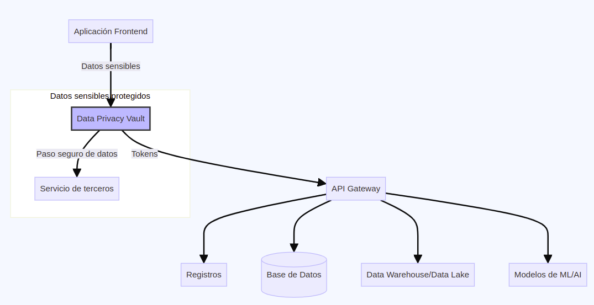

# Bóvedas de Privacidad de Datos

Las Bóvedas de Privacidad de Datos ("Data Privacy Vaults") son una técnica de seguridad de la información que combina varios enfoques, como cifrado, control de acceso y privacidad diferencial, para proteger datos sensibles mientras se utilizan para entrenar modelos de lenguaje grandes (LLMs). Es una tecnología que aísla, asegura y controla estrictamente el acceso para administrar, monitorear y utilizar datos sensibles.

## ¿Cómo funcionan?

1. **Aislamiento de datos**: Centraliza los datos sensibles en un entorno seguro separado del resto de la infraestructura, evitando la propagación de datos sensibles.

2. **Cifrado**: Cifra los datos sensibles y los reemplaza con "tokens" sin valor para usar en el resto de los sistemas.

3. **Control de acceso**: Solo entidades autorizadas y verificadas pueden acceder a los datos dentro de la bóveda. Aplica arquitectura de confianza cero y controles de acceso basados en roles y cuentas para limitar el acceso solo a lo estrictamente necesario.

4. **Privacidad diferencial**: Se aplica privacidad diferencial a los datos antes de utilizarlos para entrenamiento, lo que agrega ruido calculado para ocultar información sensible.

5. **Entrenamiento seguro**: Los datos procesados y protegidos se utilizan para entrenar el modelo sin exponer los datos sin procesar.

6. **Auditoría y monitoreo**: Se realiza un seguimiento exhaustivo de todas las operaciones dentro de la bóveda para detectar y mitigar fugas de datos. Permite configurar qué datos proteger y cómo mostrarlos.

## Ejemplos y herramientas

- **[OpenMined Privacy Vaults](https://openprivacy.io/)**: Una implementación de bóvedas de privacidad de código abierto centrada en la privacidad diferencial.
- **[Duality Confidential Computing](https://dualitytech.com/platform/technology-confidential-computing/)**: Una plataforma de computación confidencial que utiliza hardware seguro para aislar y proteger datos sensibles.

## Características y beneficios

- **Protección de datos sólida**: Los datos sensibles están muy protegidos mediante múltiples capas de seguridad.
- **Privacidad preservada**: Las técnicas de privacidad diferencial ocultan información identificable.
- **Cumplimiento normativo**: Ayuda a cumplir con regulaciones de privacidad de datos como GDPR y CCPA.
- **Confianza aumentada**: Las partes interesadas pueden confiar en que sus datos se manejan de manera segura.
- **Análisis de datos** Permite el uso de datos para análisis y otros flujos críticos.

## Desventajas y riesgos

- **Complejidad**: Implementar y mantener bóvedas de privacidad puede ser complejo y costoso.
- **Rendimiento**: El procesamiento adicional de datos puede afectar el rendimiento del entrenamiento.
- **Riesgo residual**: Ningún sistema es 100% a prueba de fallas; siempre existe un riesgo residual de violación de datos.
- **Requisitos de hardware**: Algunas soluciones requieren hardware especializado y seguro.

A pesar de los desafíos, las bóvedas de privacidad de datos son una técnica prometedora para permitir el uso de datos sensibles para entrenar LLMs de manera segura y respetuosa con la privacidad.

## Integración en la arquitectura
Las bóvedas de privacidad de datos actúan como fuente única de datos sensibles, desacoplando el resto de la infraestructura de las responsabilidades de privacidad y cumplimiento. Reemplaza datos sensibles con tokens seguros en bases de datos, datos lakes, etc. Ver siguiente diagrama.

### Proceso de integración de Bóvedas de Privacidad de Datos

* La Aplicación Frontend envía los Datos Sensibles al Data Privacy Vault (DPV).
* El DPV genera Tokens que representan los datos sensibles y los envía al API Gateway.
* El API Gateway distribuye los Tokens a varios componentes downstream como Registros, Base de Datos, Data Warehouse/Data Lake y Modelos de ML/IA.
* Cuando un servicio de terceros necesita acceder a los datos sensibles reales, el DPV pasa estos datos de forma segura al servicio de terceros.
* Al centralizar y aislar los datos sensibles en el DPV, el resto de la infraestructura se desacopla de las responsabilidades de privacidad y cumplimiento, trabajando solo con tokens seguros.
El diagrama ilustra cómo el DPV actúa como una capa de aislamiento y control de acceso alrededor de los datos sensibles, facilitando su uso seguro en flujos de trabajo críticos al tiempo que protege la privacidad.

Así, los flujos que requieren datos reales (como enviar un SMS) se canalizan a través de la bóveda, que interactúa de forma segura con los servicios externos necesarios.

##Conclusión
En resumen, los Bóvedas de Privacidad de Datos o Data Privacy Vaults, brindan una capa de aislamiento, protección y control de acceso alrededor de los datos sensibles, permitiendo su uso seguro en flujos de trabajo críticos al tiempo que facilitan el cumplimiento normativo.
