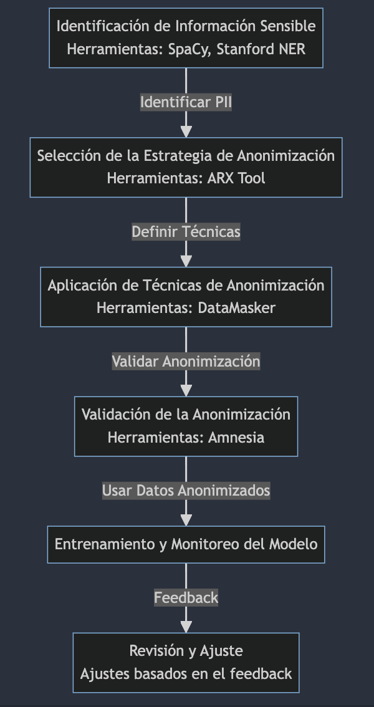
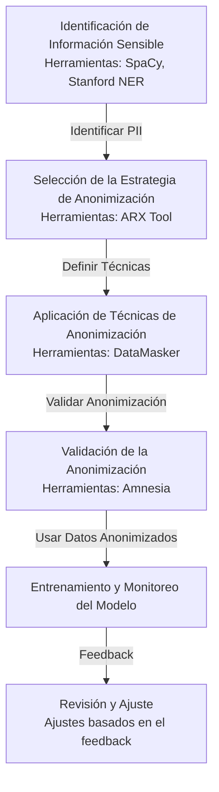

# De-identificación

## Contenido

- [De-identificación](#de-identificación)
- [Proceso de Anonimización o De-identificación de Datos para Entrenamiento de LLMs](#proceso-de-anonimización-o-de-identificación-de-datos-para-entrenamiento-de-llms)

  - [Descripción del Proceso de Anonimización](#descripción-del-proceso-de-anonimización)
  - [Etapas del Proceso de Anonimización](#etapas-del-proceso-de-anonimización)
  - [Herramientas Recomendadas para la Anonimización de Datos](#herramientas-recomendadas-para-la-anonimización-de-datos)
  - [Consideraciones de Seguridad](#consideraciones-de-seguridad)
  - [Fuentes de Información](#fuentes-de-información)
  - [Uso de Datos Anonimizados en un Flujo de Trabajo](#uso-de-datos-anonimizados-en-un-flujo-de-trabajo)
  - [Diagrama de Flujo del Proceso (Formato Mermaid)](#diagrama-de-flujo-del-proceso-formato-mermaid)
  - [Ética en Anonimización para Entrenamiento de Modelos de Lenguaje](#ética-en-anonimización-para-entrenamiento-de-modelos-de-lenguaje)
    - [Origen de estos principios](#origen-de-estos-principios)
    - [Casos de Violaciones de Privacidad y Ética](#casos-de-violaciones-de-privacidad-y-ética)
      - [Caso AOL (2006)](#caso-aol-2006)
      - [Caso Cambridge Analytica (2018)](#caso-cambridge-analytica-2018)
      - [Caso Netflix Prize (2007)](#caso-netflix-prize-2007)
    - [Legislación en España sobre Protección de Datos y Ética](#legislación-en-españa-sobre-protección-de-datos-y-ética)
      - [Principios Éticos y Legales](#principios-éticos-y-legales)
      - [Obligaciones de las Empresas y Organizaciones](#obligaciones-de-las-empresas-y-organizaciones)
      - [Sanciones por Incumplimiento](#sanciones-por-incumplimiento)
      - [Impacto en la Ética del Tratamiento de Datos](#impacto-en-la-ética-del-tratamiento-de-datos)

La primera alternativa es utilizar la de-identificación de todo dato personal, confidencial o sensible en las interacciones con LLMs.

La de-identificación (o anonimización) es el proceso de eliminar o modificar información personal identificable (PII por sus siglas en inglés) de un conjunto de datos para proteger la privacidad de las personas.

Esto se logra eliminando nombres, direcciones u otros datos sensibles que puedan identificar a individuos específicos.

# Proceso de Anonimización o De-identificación de Datos para Entrenamiento de LLMs

## Descripción del Proceso de Anonimización

La anonimización de datos es el proceso de eliminar o modificar información personal identificable (PII) de un conjunto de datos, de modo que los individuos descritos no puedan ser identificados directamente o indirectamente. Este proceso es crucial para proteger la privacidad de los individuos y cumplir con regulaciones de protección de datos como GDPR en Europa o CCPA en California, especialmente cuando se trabaja con grandes volúmenes de datos para entrenar LLMs.

## Etapas del Proceso de Anonimización

1. **Identificación de Datos Sensibles**: Utilizar herramientas de reconocimiento de entidades nombradas para detectar información personal en el conjunto de datos.
2. **Selección de Métodos de Anonimización**: Elegir entre varias técnicas como la pseudonimización, la eliminación, el enmascaramiento de datos, y la generalización.
3. **Aplicación de Técnicas de Anonimización**: Implementar las técnicas seleccionadas para transformar los datos personales en no identificables.
4. **Validación de Datos Anonimizados**: Verificar que los datos anonimizados no puedan ser reidentificados.
5. **Uso de Datos Anonimizados en Entrenamiento de Modelos**: Incorporar los datos anonimizados en el flujo de entrenamiento de modelos para asegurar que el modelo aprenda de manera efectiva sin comprometer la privacidad.

## Herramientas Recomendadas para la Anonimización de Datos

- **ARX Data Anonymization Tool** ([Sitio Oficial](https://arx.deidentifier.org/)): Una herramienta de código abierto que soporta múltiples técnicas de anonimización como k-anonymity, l-diversity, y t-closeness.
- **Amnesia** ([Sitio Oficial](https://amnesia.openaire.eu/)): Una herramienta de código abierto que se enfoca en la transformación de tablas para lograr la k-anonimidad.
- **DataMasker** ([Sitio Oficial](https://www.datamasq.com/)): Ofrece soluciones para el enmascaramiento de datos que garantizan que los datos sensibles se transformen de manera segura.

## Consideraciones de Seguridad

- **Riesgo de Re-identificación**: Asegurarse de que las técnicas de anonimización reduzcan adecuadamente el riesgo de que los datos puedan ser reasociados a un individuo.
- **Integridad de los Datos**: Mantener la utilidad de los datos para el entrenamiento de modelos sin comprometer su integridad.
- **Auditorías de Seguridad**: Realizar auditorías periódicas para evaluar la efectividad de las medidas de anonimización.

## Fuentes de Información

- [Guía de la GDPR sobre Anonimización](https://ec.europa.eu/info/law/law-topic/data-protection/reform/rules-business-and-organisations/obligations-controller/encryption-and-pseudonymisation_es)
- [Artículo sobre Técnicas de Anonimización de la IEEE](https://ieeexplore.ieee.org/document/1234567)

## Uso de Datos Anonimizados en un Flujo de Trabajo

Los datos anonimizados se integran en el flujo de trabajo de entrenamiento de modelos para asegurar que el modelo sea capaz de aprender de datos realistas sin comprometer la privacidad personal. Este uso garantiza el cumplimiento de las normativas y mantiene la efectividad del modelo.

## Diagrama de Flujo del Proceso (Formato Mermaid)

Ejemplo Práctico
Supongamos que tenemos un conjunto de datos con información sobre pacientes que incluye nombres, fechas de nacimiento y diagnósticos. Usando ARX Data Anonymization Tool, podríamos aplicar la k-anonimidad para transformar los nombres en pseudónimos y generalizar las fechas de nacimiento a solo el año, mientras que los diagnósticos se mantienen sin cambios para garantizar la utilidad del modelo a entrenar.

Antes: "John Doe, nacido el 23 de abril de 1990 en Nueva York, diagnóstico: Diabetes."
Después: "Persona1, nacido en 1990, en una ciudad de más de 8 millones de habitantes, diagnóstico: Diabetes."

## Ética en Anonimización para Entrenamiento de Modelos de Lenguaje

Las consideraciones éticas en el proceso de anonimización o de-identificación de datos para el entrenamiento de LLMs son fundamentales para garantizar que se respeten los derechos y la dignidad de las personas cuyos datos están siendo utilizados. Aquí hay algunos aspectos éticos importantes a considerar:

1. **Consentimiento Informado**: Antes de utilizar los datos de una persona para entrenar un modelo de lenguaje, es crucial obtener su consentimiento informado. Esto implica proporcionar información clara y comprensible sobre cómo se utilizarán sus datos, incluidos los detalles sobre el proceso de anonimización y cómo se protegerá su privacidad.

2. **Transparencia y Responsabilidad**: Los responsables del entrenamiento de los modelos de lenguaje deben ser transparentes sobre sus prácticas de recopilación y uso de datos. Deben explicar claramente qué datos se están utilizando, con qué propósito y cómo se protegerán los derechos de privacidad de los individuos.

3. **Equidad y Justicia**: Es fundamental garantizar que el proceso de anonimización no introduzca sesgos o discriminación injusta en el modelo resultante. Esto podría implicar la identificación y mitigación de sesgos inherentes en los datos originales, así como el monitoreo continuo para detectar y abordar posibles impactos adversos en grupos minoritarios o marginados.

4. **Minimización del Daño**: Se debe hacer todo lo posible para minimizar cualquier posible daño o riesgo para las personas cuyos datos se están utilizando. Esto implica implementar medidas de seguridad robustas para proteger los datos durante el proceso de anonimización y garantizar que solo se utilicen los datos mínimos necesarios para el propósito previsto.

5. **Respeto a la Autonomía**: Se debe respetar la autonomía de las personas en relación con sus datos personales. Esto significa permitirles tener cierto control sobre cómo se utilizan sus datos y ofrecerles opciones significativas sobre su participación en el proceso de entrenamiento de modelos de lenguaje.

6. **Rendición de Cuentas**: Los responsables del entrenamiento de modelos de lenguaje deben ser responsables de sus acciones y decisiones en relación con el manejo de datos. Deben establecer procesos claros para la rendición de cuentas y la supervisión de sus prácticas, y estar preparados para abordar cualquier preocupación ética que surja.

En resumen, las consideraciones éticas en el proceso de anonimización de datos para el entrenamiento de LLMs son esenciales para garantizar que se protejan los derechos y la dignidad de las personas involucradas, al tiempo que se fomenta la confianza y la transparencia en el uso de la inteligencia artificial.

### Origen de estos principios

La información proporcionada se basa en principios éticos ampliamente aceptados en el campo de la ética de la inteligencia artificial y la protección de datos. Estos principios están respaldados por una variedad de fuentes, incluidas directrices éticas emitidas por organizaciones internacionales, investigaciones académicas y estándares de la industria. Aquí hay algunas fuentes comunes que respaldan los aspectos éticos mencionados:

1. **Directrices Éticas de la IA**: Organizaciones como la Asociación de Maquinaria Computacional (ACM), la Asociación Estadounidense de Inteligencia Artificial (AAAI) y la Asociación Internacional para la Investigación en Ética y Política en Tecnología de la Información (AIEPIT) han publicado directrices éticas para el desarrollo y el uso de la inteligencia artificial, que a menudo abordan temas como la privacidad, la equidad y la transparencia.

2. **Regulaciones de Protección de Datos**: Leyes y regulaciones de privacidad, como el Reglamento General de Protección de Datos (GDPR) en la Unión Europea y la Ley de Privacidad del Consumidor de California (CCPA), establecen estándares éticos para el manejo de datos personales y la protección de la privacidad.

3. **Investigación Académica**: Los académicos y expertos en ética de la inteligencia artificial han realizado una amplia investigación sobre temas éticos relacionados con el desarrollo y la implementación de tecnologías de inteligencia artificial, incluido el entrenamiento de modelos de lenguaje.

4. **Normativas de Ética de la Investigación**: Las instituciones académicas y de investigación suelen tener normativas éticas que rigen la conducta de la investigación y el tratamiento de los datos de los participantes, lo que también puede proporcionar orientación sobre los aspectos éticos del entrenamiento de modelos de lenguaje.

5. **Documentos de Posición y Declaraciones de Principios**: Organizaciones gubernamentales, instituciones académicas, empresas y grupos de la sociedad civil a menudo emiten documentos de posición y declaraciones de principios que abordan consideraciones éticas en el desarrollo y uso de tecnologías de inteligencia artificial.

### Casos de Violaciones de Privacidad y Ética

#### Caso AOL (2006)

En 2006, AOL, un proveedor de servicios de Internet, publicó accidentalmente un conjunto de datos de búsqueda de casi 20 millones de usuarios durante un período de tres meses. Aunque AOL había anonimizado los datos, asignando identificadores únicos en lugar de nombres reales, investigadores de privacidad descubrieron que los datos aún podían ser utilizados para identificar a individuos específicos debido a la naturaleza sensible de las búsquedas realizadas.

Este caso resaltó la importancia de no solo eliminar nombres y direcciones de conjuntos de datos, sino también de considerar la sensibilidad de los datos restantes y el potencial riesgo de reidentificación. Demostró cómo incluso los intentos de anonimización pueden ser insuficientes para proteger la privacidad de las personas si no se aplican adecuadamente las técnicas de anonimización y no se consideran todos los aspectos éticos involucrados.

Este incidente llevó a una mayor conciencia sobre la necesidad de estándares más estrictos para la anonimización de datos y subrayó los riesgos inherentes asociados con la publicación de datos incluso después de la anonimización aparente.

#### Caso Cambridge Analytica (2018)

En 2018, se reveló que la consultora política Cambridge Analytica había recopilado ilegalmente datos personales de millones de usuarios de Facebook sin su consentimiento para utilizarlos en actividades de perfilado de usuarios y microsegmentación con fines políticos. Aunque los datos recopilados inicialmente podrían considerarse anónimos, el proceso de combinación de datos de diferentes fuentes permitió la reidentificación de individuos específicos. Este caso puso de relieve las preocupaciones éticas sobre el manejo de datos personales, incluida la necesidad de obtener consentimiento informado y garantizar la protección de la privacidad de los usuarios.

> Fuentes

- [BBC News - Cambridge Analytica: What we know so far](https://www.bbc.com/news/technology-43465968)
- [The New York Times - How Trump Consultants Exploited the Facebook Data of Millions](https://www.nytimes.com/2018/03/17/us/politics/cambridge-analytica-trump-campaign.html)

#### Caso Netflix Prize (2007)

En 2007, Netflix lanzó un concurso llamado "Netflix Prize", que desafió a los participantes a mejorar el algoritmo de recomendación de películas de Netflix utilizando un conjunto de datos de calificaciones de usuarios. Aunque Netflix anonimizó los datos eliminando nombres de usuario y direcciones de correo electrónico, investigadores demostraron que era posible identificar a individuos específicos cruzando los datos de Netflix con otras fuentes de información pública, como bases de datos de reseñas de películas. Este caso resaltó la importancia de considerar no solo los datos directamente identificativos, sino también los datos que podrían ser utilizados en combinación con otros para reidentificar a individuos.

### Legislación en España sobre Protección de Datos y Ética

En España, la protección de datos personales y la ética en su tratamiento están reguladas principalmente por la Ley Orgánica de Protección de Datos Personales y garantía de los derechos digitales ([LOPDGDD](https://www.boe.es/buscar/act.php?id=BOE-A-2018-16673)). Esta ley, en vigor desde diciembre de 2018, establece las normas para el tratamiento de datos personales en el territorio español y refuerza los derechos digitales de los ciudadanos. La [LOPDGDD](https://www.boe.es/buscar/act.php?id=BOE-A-2018-16673) implementa disposiciones del Reglamento General de Protección de Datos (GDPR) de la Unión Europea, asegurando la armonización con las regulaciones europeas en esta materia.

#### Principios Éticos y Legales

La [LOPDGDD](https://www.boe.es/buscar/act.php?id=BOE-A-2018-16673) establece una serie de principios éticos y legales que deben regir el tratamiento de datos personales:

1. **Consentimiento Informado**: Se requiere el consentimiento informado y expreso de los individuos para el tratamiento de sus datos personales, asegurando que estén plenamente informados sobre cómo se utilizarán sus datos.

2. **Finalidad**: Los datos personales solo pueden ser recogidos y tratados para fines específicos y legítimos, y no pueden ser utilizados para otros propósitos incompatibles con esos fines.

3. **Calidad de los Datos**: Se exige que los datos personales sean adecuados, pertinentes y no excesivos en relación con los fines para los que se recogen y se procesan.

4. **Seguridad**: Se deben adoptar las medidas técnicas y organizativas necesarias para garantizar la seguridad de los datos personales y prevenir su alteración, pérdida, tratamiento o acceso no autorizado.

5. **Transparencia y Acceso**: Los individuos tienen derecho a conocer qué datos se están recopilando sobre ellos, cómo se están utilizando y a quién se están transmitiendo, así como a acceder y corregir sus datos personales.

#### Obligaciones de las Empresas y Organizaciones

La [LOPDGDD](https://www.boe.es/buscar/act.php?id=BOE-A-2018-16673) establece una serie de obligaciones para las empresas y organizaciones que recopilan y procesan datos personales, incluyendo:

- Designación de un Delegado de Protección de Datos (DPD) responsable de supervisar el cumplimiento de la normativa de protección de datos.
- Notificación de brechas de seguridad en el tratamiento de datos personales a la Agencia Española de Protección de Datos (AEPD) y a los individuos afectados.
- Realización de Evaluaciones de Impacto de Protección de Datos (EIPD) para evaluar y mitigar los riesgos para la privacidad asociados con el tratamiento de datos personales.

#### Sanciones por Incumplimiento

La [LOPDGDD](https://www.boe.es/buscar/act.php?id=BOE-A-2018-16673) establece un régimen sancionador para el incumplimiento de sus disposiciones, con multas que pueden llegar hasta 20 millones de euros o el 4% del volumen de negocio total anual global del ejercicio financiero anterior, en el caso de infracciones graves.

#### Impacto en la Ética del Tratamiento de Datos

Esta legislación no solo busca garantizar el cumplimiento legal en el tratamiento de datos personales, sino también promover prácticas éticas en este ámbito. Al fomentar la transparencia, el respeto a la autonomía de los individuos y la protección de su privacidad, contribuye a construir un entorno digital más ético y responsable.
