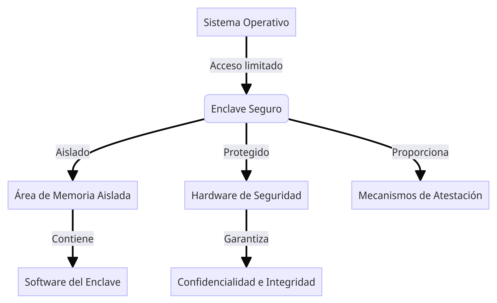

# Curso de Principiante en Enclaves Seguros

## Índice de contenidos

1. [Introducción](#introducción)
2. [¿Qué son los Enclaves Seguros?](#qué-son-los-enclaves-seguros)
3. [Aplicaciones de los Enclaves Seguros](#aplicaciones-de-los-enclaves-seguros)
4. [Componentes de un Enclave Seguro](#componentes-de-un-enclave-seguro)
5. [Tecnologías de Enclaves Seguros](#tecnologías-de-enclaves-seguros)
  - [Intel SGX](#intel-sgx)
  - [AMD SEV](#amd-sev)
  - [ARM TrustZone](#arm-trustzone)
6. [Ejemplos de Implementaciones](#ejemplos-de-implementaciones)
7. [Ciclo de Vida de un Enclave Seguro](#ciclo-de-vida-de-un-enclave-seguro)
8. [Consideraciones de Seguridad](#consideraciones-de-seguridad)
9. [Recursos Adicionales](#recursos-adicionales)

## Introducción

En este curso, aprenderás sobre los Enclaves Seguros, una tecnología clave para proteger datos confidenciales y aplicaciones críticas en entornos informáticos. Los Enclaves Seguros son áreas de memoria aisladas y protegidas dentro de un procesador, donde se pueden ejecutar código y procesar datos de manera segura, incluso si el sistema operativo o el resto del hardware están comprometidos.

## ¿Qué son los Enclaves Seguros?

Un Enclave Seguro es un entorno de ejecución confiable y aislado dentro de un sistema, diseñado para proteger datos sensibles y código crítico de posibles amenazas externas. Este entorno garantiza la confidencialidad, integridad y privacidad de los datos y el código que se ejecuta dentro del enclave, incluso si el resto del sistema ha sido comprometido.

## Aplicaciones de los Enclaves Seguros

Los Enclaves Seguros tienen numerosas aplicaciones en diferentes áreas, como:

- Procesamiento seguro de datos confidenciales (por ejemplo, en el ámbito financiero, médico o gubernamental).
- Protección de propiedad intelectual y secretos comerciales.
- Ejecución segura de código crítico (como aplicaciones de seguridad, criptografía, etc.).
- Computación confidencial en entornos de nube pública.
- Aplicaciones descentralizadas (DApps) y contratos inteligentes.

## Componentes de un Enclave Seguro

Un Enclave Seguro consta de los siguientes componentes principales:

1. **Área de Memoria Aislada**: Una sección de memoria protegida y aislada del resto del sistema, donde se almacena y ejecuta el código y los datos del enclave.
2. **Hardware de Seguridad**: Componentes de hardware especializados que protegen el enclave y garantizan su integridad y confidencialidad.
3. **Software del Enclave**: El código y las aplicaciones que se ejecutan dentro del enclave.
4. **Mecanismos de Atestación**: Procesos que permiten verificar la autenticidad e integridad del enclave.

El siguiente diagrama ilustra la estructura básica de un Enclave Seguro:

## Tecnologías de Enclaves Seguros
Existen varias tecnologías de hardware que implementan Enclaves Seguros, incluyendo:

### Intel SGX
**Intel Software Guard Extensions (SGX)** es una tecnología de enclaves seguros desarrollada por Intel. Proporciona áreas de memoria aisladas y protegidas dentro del procesador, donde se pueden ejecutar aplicaciones y procesar datos de manera segura.

### AMD SEV
**Secure Encrypted Virtualization (SEV)** es la solución de enclaves seguros de AMD. Permite crear máquinas virtuales encriptadas y aisladas, protegiendo los datos y el código de posibles amenazas externas.

### ARM TrustZone
**TrustZone** es una tecnología de seguridad desarrollada por ARM que proporciona un entorno de ejecución seguro y aislado dentro de los procesadores ARM. Se utiliza ampliamente en dispositivos móviles y sistemas embebidos.

## Ejemplos de Implementaciones
Aquí hay algunos ejemplos de cómo se han implementado los Enclaves Seguros en diferentes aplicaciones:

- **Procesamiento de Datos Confidenciales en la Nube**: Empresas financieras y de atención médica han utilizado Enclaves Seguros para procesar datos confidenciales de clientes en entornos de nube pública, protegiendo la información sensible de posibles amenazas.
- **Protección de Propiedad Intelectual**: Compañías de software y videojuegos han empleado Enclaves Seguros para ejecutar código crítico y proteger su propiedad intelectual de ingeniería inversa y piraterías.
- **Computación Confidencial en Blockchains**: Proyectos de blockchain han implementado Enclaves Seguros para ejecutar contratos inteligentes y cálculos confidenciales sin revelar los datos subyacentes.
- **Sistemas de Identificación Digital**: Los gobiernos han explorado el uso de Enclaves Seguros para almacenar y procesar de manera segura información de identificación personal en sistemas digitales.
- **Sistemas de Pago Seguros**: Procesadores de pagos y proveedores de servicios financieros han utilizado Enclaves Seguros para proteger los datos de transacciones y las claves criptográficas durante el procesamiento de pagos.

Estos son solo algunos ejemplos, pero los Enclaves Seguros tienen un amplio rango de aplicaciones en cualquier área donde sea necesario proteger datos confidenciales y código crítico.

## Ciclo de Vida de un Enclave Seguro
El ciclo de vida de un Enclave Seguro consta de las siguientes etapas:

1. **Inicialización**: El enclave se crea y se configura dentro del área de memoria aislada.
2. **Atestación**: Se verifica la autenticidad e integridad del enclave mediante mecanismos de atestación.
3. **Ejecución**: El software del enclave se ejecuta de manera segura dentro del área de memoria aislada.
4. **Finalización**: Cuando ya no se necesita, el enclave se destruye de manera segura, eliminando cualquier dato sensible de la memoria.

## Consideraciones de Seguridad
Aunque los Enclaves Seguros ofrecen un alto nivel de protección, es importante tener en cuenta las siguientes consideraciones de seguridad:

- Los enclaves no son completamente invulnerables a ataques sofisticados y vulnerabilidades de hardware.
- La implementación y configuración correcta de los enclaves es crucial para garantizar su seguridad.
- Los datos deben ser manejados de manera segura fuera del enclave, ya que la protección se limita al área de memoria aislada.
- Se deben seguir las mejores prácticas de seguridad durante todo el ciclo de vida del enclave.

## Recursos Adicionales

- [Intel SGX Developer Guide](https://software.intel.com/content/www/us/en/develop/topics/software-guard-extensions.html)
- [AMD Secure Encrypted Virtualization (SEV)](https://developer.amd.com/sev/)
- [ARM TrustZone Technology](https://developer.arm.com/ip-products/security-ip/trustzone)
- [Enclave-Aware Programming with Intel SGX](https://www.intel.com/content/www/us/en/developer/articles/technical/sgx-intro-passing-data-between-app-and-enclave.html)
- [Microsoft Open Enclave SDK](https://openenclave.io/)
- [Curso en línea de Enclaves Seguros (Coursera)](https://www.coursera.org/learn/ve-a-lo-seguro-gestiona-los-riesgos-de-seguridad)
- [Proyecto Graphene: Biblioteca para Enclaves Seguros](https://grapheneproject.io/)
- [Documentación de Enclaves Seguros en la Nube (AWS)](https://aws.amazon.com/es/ec2/nitro/nitro-enclaves/)