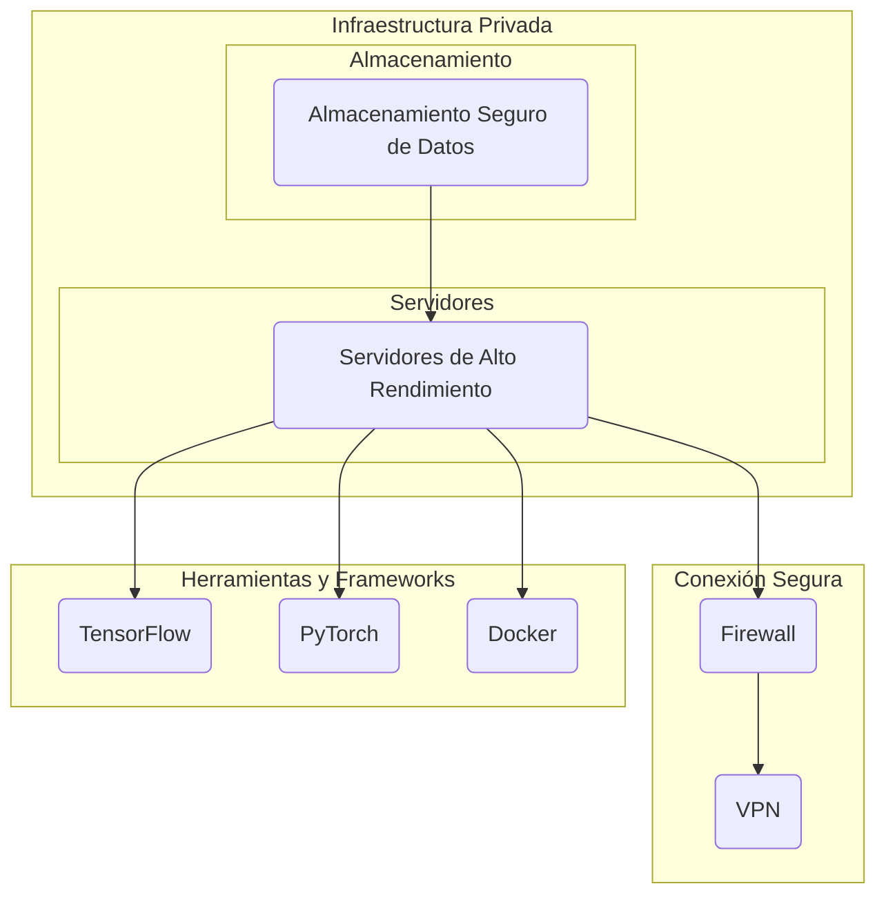

# **Implementación de Modelos de Lenguaje con Grandes Dimensiones (LLMs) en Infraestructura Privada**

1. [Introducción](#introducción)

2. [¿Qué son los LLMs?](#qué-son-los-llms)

    - [Ejemplos de LLMs Open Source](#ejemplos-de-llms-open-source)

3. [Ventajas de Ejecutar LLMs de Manera Privada](#ventajas-de-ejecutar-llms-de-manera-privada)

    - [Seguridad de Datos](#seguridad-de-datos)

    - [Protección de la Propiedad Intelectual](#protección-de-la-propiedad-intelectual)

4. [Infraestructura Necesaria](#infraestructura-necesaria)

    - [Servidores de Alto Rendimiento](#servidores-de-alto-rendimiento)

    - [Almacenamiento Seguro](#almacenamiento-seguro)

5. [Herramientas Recomendadas](#herramientas-recomendadas)

    - [TensorFlow](#tensorflow)

    - [PyTorch](#pytorch)

    - [Docker](#docker)

6. [Diagrama de Infraestructura](#seguridad-de-infraestuctura)

7. [Conclusiones](#conclusiones)

8. [Recursos de información](#recursos-de-información)

  

## **Introducción**  

Los Modelos de Lenguaje con Grandes Dimensiones (LLMs) son una forma avanzada de inteligencia artificial que ha revolucionado la forma en que las máquinas comprenden y generan texto. Su capacidad para analizar y generar texto de manera casi humana ha impulsado una amplia gama de aplicaciones, desde la traducción automática hasta la generación de contenido creativo.

En este informe, exploraremos cómo las organizaciones pueden aprovechar los LLMs en su infraestructura privada para mejorar la productividad de los empleados y proteger la privacidad de los usuarios y la propiedad intelectual de la empresa.

  

## **¿Qué son los LLMs?**  

Los LLMs son modelos de inteligencia artificial que utilizan arquitecturas basadas en transformers para entender y generar texto. Estos modelos se entrenan en grandes conjuntos de datos textuales y son capaces de predecir la siguiente palabra en una oración o generar texto completo basado en un contexto dado.

  

### **Ejemplos de LLMs Open Source**  

Algunos ejemplos populares de LLMs open source incluyen:  

-  **GPT (Generative Pre-trained Transformer)**: Desarrollado por OpenAI, este modelo es conocido por su capacidad para generar texto coherente y relevante en una amplia variedad de contextos.

-  **BERT (Bidirectional Encoder Representations from Transformers)**: Desarrollado por Google, BERT es especialmente eficaz para comprender el contexto en el que se encuentra una palabra en una oración, lo que lo hace útil para tareas de comprensión de lenguaje natural.

  

## **Ventajas de Ejecutar LLMs de Manera Privada**  

### **Seguridad de Datos**  

Al ejecutar LLMs en la propia infraestructura de la empresa, se reduce el riesgo de fugas de datos y se asegura la privacidad de los usuarios y empleados. Los datos sensibles no tienen que ser compartidos con servicios externos, lo que reduce la exposición a posibles violaciones de seguridad.

  

### **Protección de la Propiedad Intelectual**  

Al evitar depender de servicios externos, se protege la propiedad intelectual de la empresa al mantener el control total sobre los datos y los modelos de inteligencia artificial. Esto evita la posibilidad de que la información confidencial sea comprometida o utilizada por terceros sin autorización.

  

## **Infraestructura Necesaria**
  

### **Servidores de Alto Rendimiento**

Para ejecutar eficientemente los modelos LLM, se necesitan servidores de alto rendimiento con capacidades de procesamiento y memoria suficientes para manejar grandes volúmenes de datos y cálculos intensivos.

  

### **Almacenamiento Seguro**  

Se requiere un almacenamiento seguro de datos para almacenar grandes conjuntos de datos textuales de manera protegida. Esto puede incluir sistemas de almacenamiento en la nube o servidores locales con medidas de seguridad adecuadas.

  

## **Herramientas Recomendadas**  

### **TensorFlow**  

TensorFlow es un framework de machine learning de código abierto desarrollado por Google. Ofrece una amplia gama de herramientas y recursos para entrenar, implementar y gestionar modelos de inteligencia artificial, incluidos los LLMs.

  

### **PyTorch**  

PyTorch es otro framework popular de machine learning de código abierto, mantenido por Facebook. Es conocido por su flexibilidad y facilidad de uso, lo que lo convierte en una opción atractiva para desarrolladores y científicos de datos.

  

### **Docker**  

Docker es una plataforma de contenedores que permite encapsular y distribuir aplicaciones y entornos de manera consistente y portátil. Puede ser utilizado para empaquetar los entornos de ejecución de los modelos LLM y facilitar su implementación en diferentes sistemas.

  

## **Diagrama de Infraestructura**
  

  

## **Conclusiones**

La implementación de LLMs en la infraestructura privada de una empresa ofrece numerosas ventajas, incluida la mejora de la seguridad de los datos y la protección de la propiedad intelectual. Con la infraestructura adecuada y las herramientas adecuadas, las organizaciones pueden aprovechar el poder de los LLMs para mejorar la productividad de los empleados y desarrollar soluciones innovadoras mientras protegen la privacidad y la propiedad intelectual.

  

## **Recursos de información**
  

- [OpenAI](https://openai.com/): Sitio web oficial de OpenAI, donde se pueden encontrar recursos sobre LLMs y otros proyectos de inteligencia artificial.

- [GitHub](https://github.com/): Plataforma de desarrollo colaborativo de software, donde se puede acceder al código fuente de muchos modelos LLM open source.

- [TensorFlow](https://www.tensorflow.org/): Documentación oficial y recursos para TensorFlow, incluyendo guías de instalación y tutoriales.

- [PyTorch](https://pytorch.org/): Documentación oficial y recursos para PyTorch, incluyendo guías de instalación y tutoriales.